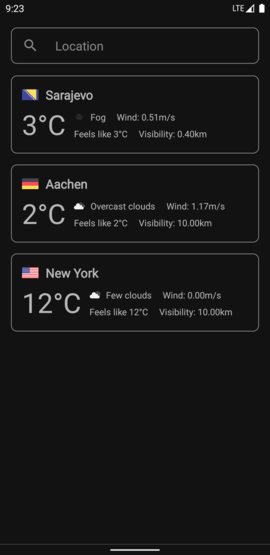
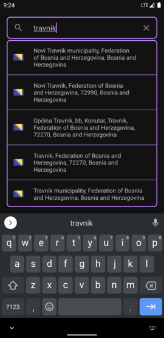
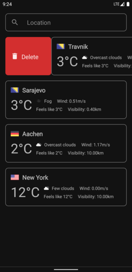
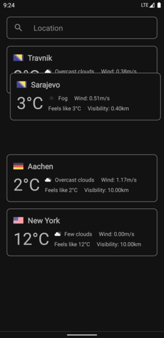
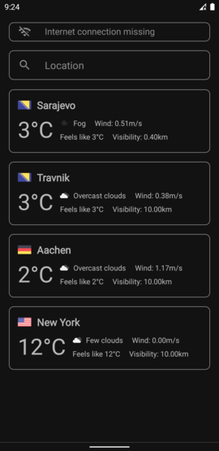
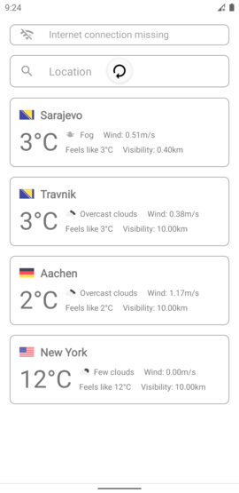

# Weather Forecast

A simplified weather forecast app done using Android's View system. For the updated version done using the new Android's UI toolkit Jetpack Compose visit 
https://github.com/grb0/weather-forecast.

In order to build the project you'll have to provide:
* **google-services.json** file to the *app* folder, or alternatively disable firebase features altogether by either deleting or commenting out the corresponding code
* api keys in the file *local.properties* as follows:
    * **LOCATION_IQ_API_KEY=***<location_iq_api_key>* (obtained at https://locationiq.com)
    * **OPEN_WEATHER_API_KEY=***<open_weather_api_key>* (obtained at https://openweathermap.org)
    
Libraries used:
* Hilt
* Timber
* Firebase
* Retrofit
* Moshi
* Room
* Coil
* Fuzzywuzzy

Some screenshots:

